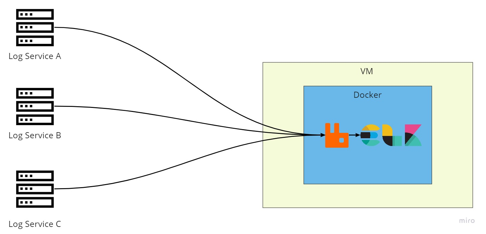

# ELK Stack with Docker Documentation

Repository ini berisi tentang tutorial instalasi dan konfigurasi ELK Stack with rabbitmq container version

# Spesification

**OS** : Ubuntu Server 20.04

**Machine type** : e2-medium

**Memory** : 8 GB

**Disk** : 50 GB

**Docker version** : 20.10.17, build 100c701

# Environment



# Docker Installation

Sebelum menginstall docker, kita akan melakukan setup Docker repository terlebih dahulu.

Lakukan update apt package index

```bash
sudo apt-get update
```

install package untuk allow apt to use a repository over HTTPS

```bash
 sudo apt-get install ca-certificates gnupg lsb-release
```

buat folder untuk Docker Official GPG Key

```bash
sudo mkdir -p /etc/apt/keyrings
```

tambahkan Docker Official GPG Key

```bash
curl -fsSL https://download.docker.com/linux/ubuntu/gpg | sudo gpg --dearmor -o /etc/apt/keyrings/docker.gpg
```

setup repository Docker ubuntu

```bash
echo "deb [arch=$(dpkg --print-architecture) signed-by=/etc/apt/keyrings/docker.gpg] https://download.docker.com/linux/ubuntu $(lsb_release -cs) stable" | sudo tee /etc/apt/sources.list.d/docker.list > /dev/null
```

lakukan update

```bash
sudo apt-get update
```

install Docker Engine

```bash
sudo apt-get install docker-ce docker-ce-cli containerd.io docker-compose-plugin
```

Test Docker Engine dengan mencoba menjalankan command berikut

```bash
sudo docker run hello-world
```

# Clone Repository Docker-ELK

Clone repository Docker-ELK

```bash
git clone https://github.com/nvlannasik/ELK-DOCKER-DOCUMENTATION.git
```

masuk ke direktori Docker-ELK

```bash
cd DOCKER-ELK-DOCUMENTATION
```

Jalankan command berikut untuk mendeploy Docker-ELK

```bash
docker compose up -d
```

# Access ELK Stack + RabbitMQ

untuk mengakses dashboard kibana

```bash
http://localhost:5601
```

untuk mengakses dashboard RabbitMQ

```bash
http://localhost:15672
```

untuk mengakses elasticsearch

```bash
http://localhost:9200
```

# Default Password

## Dashboard Kibana

**user** : elastic

**password** : changeme

## Dashboard RabbitMQ

**user** : guest

**password** : guest

## Elasticsearch

**user** : elastic

**password** : changeme

# Konfigurasi Pipeline Logstash

Didalam direktori Docker-ELK, kita akan melakukan konfigurasi pipeline Logstash.
masuk ke direktori Logstash

```bash
cd logstash/pipeline
```

lalu buat file logstash.conf

```bash
nano logstash.conf
```

Default logstash.conf pada repo yang sudah di download seperti di bawah ini:

```bash
input {
        rabbitmq {
                id => "rabbitmq_logs"
                host => "rabbitmq"
                port => 5672
                vhost => "/"
                queue => "hello"
                ack => false
                user => "guest"
                password => "guest"
        }
}

filter {
        grok {
                match => {"message" => "%{COMBINEDAPACHELOG}"}
        }
        date {
                match => ["timestamp", "dd/MM/yyyy:HH:mm:ss Z"]
        }

}

output {
        elasticsearch {
                hosts => ["elasticsearch:9200"]
                user => "elastic"
                password => "changeme"
                index => "logstash-rabbit-v1"
        }
}
```

Silahkan di sesuaikan dengan konfigurasi yang di butuhkan dan sesuai dengan konfigurasi yang ada di server.

## Authors

- [Ahmad Naoval Annasik](https://www.github.com/octokatherine)
